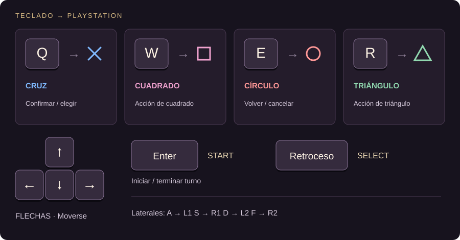

# Forbidden Memories · Amigos

Lanzador para Windows: perfiles locales sin contraseña, guía de teclado, tres mazos iniciales y salas online para dos amigos.

**[Descargar el instalador](https://github.com/Jc-asastu/forbidden-memories-amigos/releases/latest)**

## Primer inicio
1. Instalá y elegí tu nombre.
2. Pulsá **+ Agregá acá tu imagen del juego** y seleccioná tu BIN USA compatible o su CUE.
3. Esperá la preparación automática. La primera vez descarga aproximadamente210MB de herramientas y arma el juego localmente; puede tardar varios minutos y requiere variosGB de espacio libre. No necesitás instalar Python, compiladores ni configurar una memorycard.
4. Elegí campaña o amigos. Las próximas aperturas son directas.

El instalador no trae el disco ni un juego precompilado. Cada jugador aporta su propia copia. Los guardados y las herramientas quedan en LocalAppData/ForbiddenMemoriesAmigos.

## Cómo se conectan
1. Los dos usan esta misma versión.
2. Uno pulsa **Salas online → Abrir salas para mis amigos** y comparte la dirección.
3. El otro pega esa dirección y pulsa **Conectar**.
4. Crean/entran a una sala pública; solamente las privadas usan código.
5. Cada uno elige un mazo y pulsa **Estoy listo**; el anfitrión inicia el duelo.
6. En el juego original, el anfitrión elige **2P DUEL**, confirma con **Q**, carga las partidas y pulsa **Enter** en las reglas. OPEN CARD muestra las cartas de ambos.

**La PC del anfitrión es el servidor.** Cloudflare crea un acceso temporal, sin abrir puertos del router. El lanzador debe permanecer abierto; al cerrarlo termina ese acceso. No hay VPS ni servidor permanente desplegado. La dirección puede cambiar al volver a abrirlo. La descarga en GitHub funciona aunque esa PC esté apagada.

## Teclado
Flechas: moverse. **Q=cruz, W=cuadrado, E=círculo, R=triángulo. Enter=Start.** Retroceso=Select. A/S/D/F=L1/R1/L2/R2. Guía visual antes de jugar y en Controles/F1 del lanzador.

## Desarrollo
Node24 y Windowsx64. Ejecutá npm ci, npm run prepare:vendor, npm start. Para generar el instalador: npm run dist. Los archivos descargados se verifican con SHA256 y no se versionan. Para preparar el juego se usa el flujo oficial de generación local.

Pruebas: npm test. Servidor independiente: npm run server (PORT8787, HOST0.0.0.0). También se incluye un Dockerfile para alojarlo por cuenta propia.

## Alcance
Primera versión para probar entre amigos. Salas y transporte probados con dos clientes; queda por validar la experiencia desde dos domicilios distintos. No hay reconexión automática de duelos interrumpidos. El balance de los tres mazos es inicial. Windows puede mostrar editor desconocido porque el instalador no está firmado comercialmente.

El código original del lanzador es MIT; el motor base es de uso no comercial. Consultá [CREDITOS.md](CREDITOS.md) y las licencias de cada componente.
